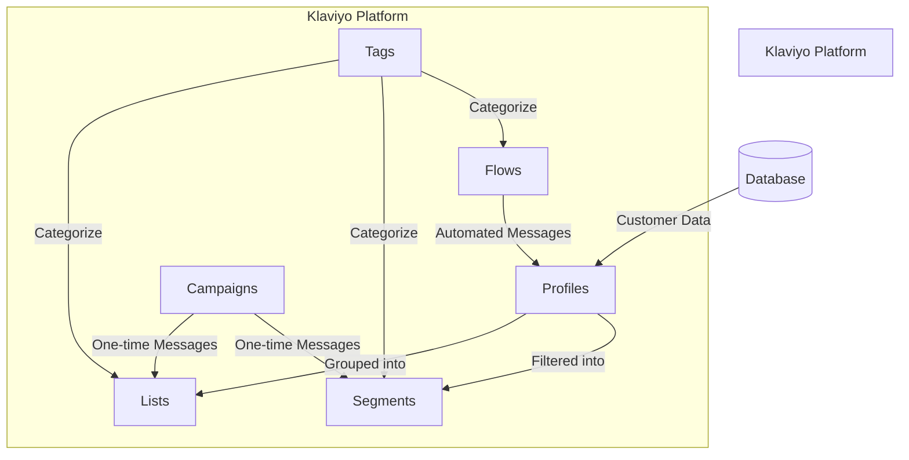
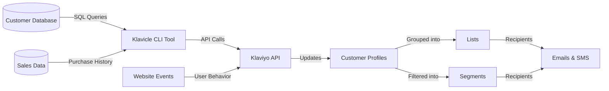
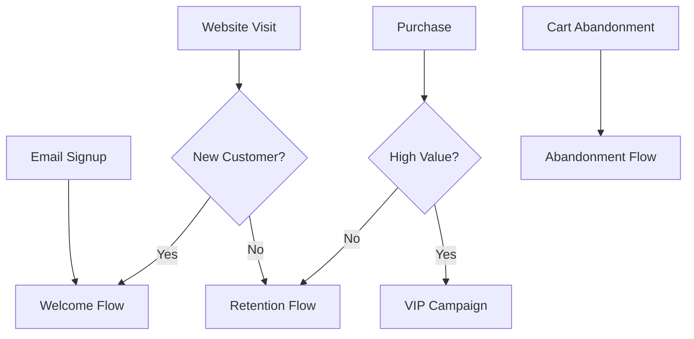
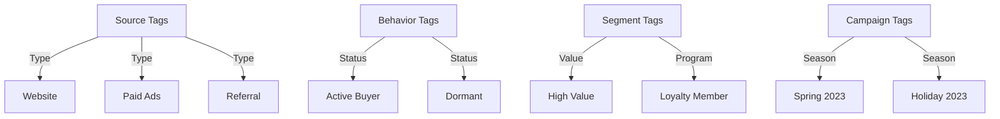
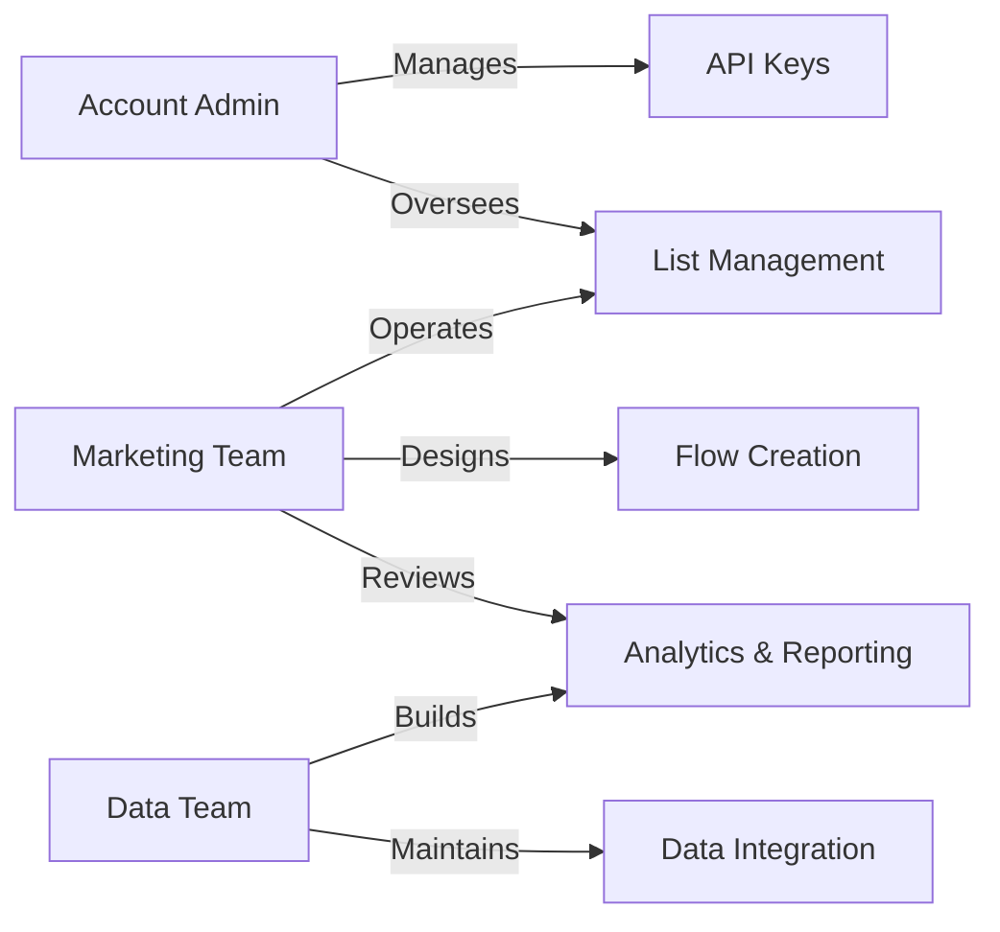
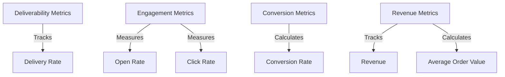

# Klaviyo Account Overview

## System Architecture

## Data Flow Overview

## Marketing Automation Structure

## Tag Organization System

## Account Administration

## Key Metrics & Reporting

