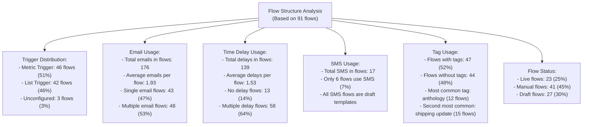
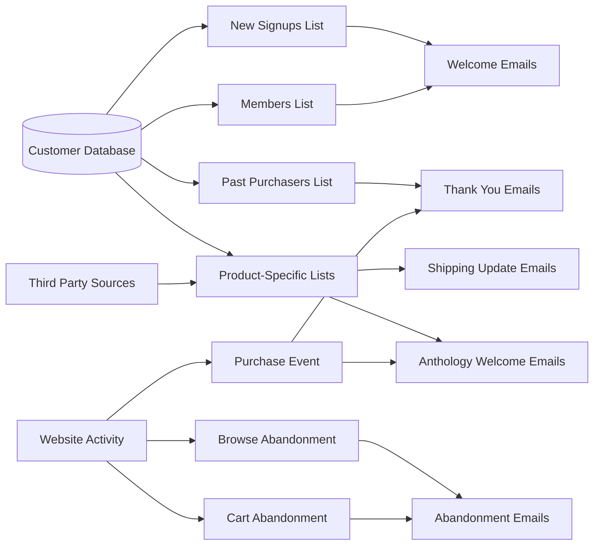
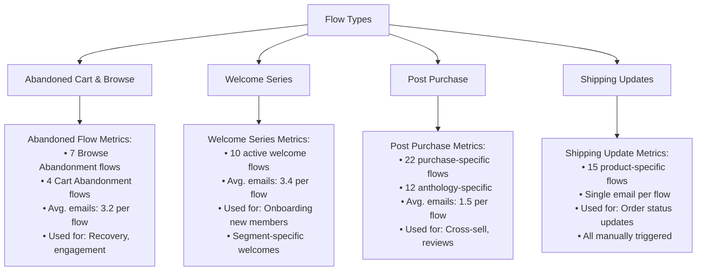
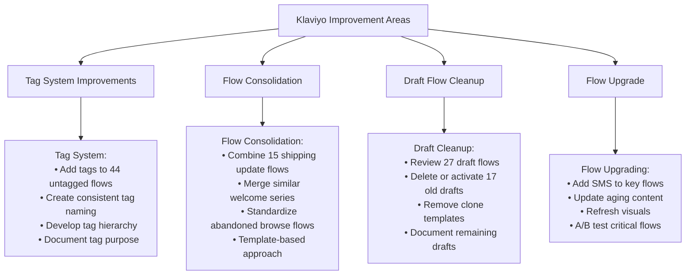

# Vinyl Me, Please Klaviyo Account Overview

## Tag Organization System

```mermaid
graph TD
    %% Main Tag Categories
    CategoryAnthology[Anthology Tags]
    CategoryShipping[Shipping Update Tags]
    CategoryBAU[Business As Usual Tags]
    CategoryProductReview[Product Review Tags]
    CategoryOther[Other Tags]

    %% Specific Tags
    Anthology[anthology]
    StaxAnthology[stax]
    WomenOfMotown[women of motown]
    GratefulDead[grateful dead]

    ShippingUpdate[shipping update]

    BAUBrowse[BAU Browse]
    BAUCheckout[BAU Checkout]

    ProductReview[product-review]

    SMS[sms]
    BCSubscribe[BC Subscribe]
    Renewals[renewals]
    Retention[retention]

    %% Connections
    CategoryAnthology --> Anthology
    CategoryAnthology --> StaxAnthology
    CategoryAnthology --> WomenOfMotown
    CategoryAnthology --> GratefulDead

    CategoryShipping --> ShippingUpdate

    CategoryBAU --> BAUBrowse
    CategoryBAU --> BAUCheckout

    CategoryProductReview --> ProductReview

    CategoryOther --> SMS
    CategoryOther --> BCSubscribe
    CategoryOther --> Renewals
    CategoryOther --> Retention
```

## Flow Analysis

```mermaid
graph TD
    %% Flow Types
    MetricTriggers[Metric Triggered Flows]
    ListTriggers[List Triggered Flows]
    Unconfigured[Unconfigured Flows]

    %% Main Flow Categories
    Abandoned[Abandoned Browsing & Cart Flows]
    WelcomeSeries[Welcome Series Flows]
    PostPurchase[Post Purchase Flows]
    ShippingUpdates[Shipping Update Flows]
    ThankYou[Thank You Flows]
    ProductReviews[Product Review Flows]
    Membership[Membership Flows]

    %% Stats for each category
    AbandonedStats["
      Abandoned Flows:
      • 8 active flows
      • Key tags: BAU Browse, BAU Checkout
      • Primarily Metric triggers
    "]

    WelcomeStats["
      Welcome Series:
      • 11 active flows
      • Both Member and new customer series
      • Primarily List triggers
    "]

    PostPurchaseStats["
      Post Purchase Flows:
      • 12 anthology-specific flows
      • All have anthology tag
      • Primarily Metric triggers
    "]

    ShippingStats["
      Shipping Update Flows:
      • 15 product-specific flows
      • All tagged with shipping update
      • All List triggers
    "]

    ThankYouStats["
      Thank You Flows:
      • 3 different flows (new/returning)
      • No tags used
      • All Metric triggers
    "]

    ProductReviewStats["
      Product Review Flows:
      • 2 flows for requesting reviews
      • Tagged with product-review
      • Metric triggers
    "]

    MembershipStats["
      Membership Flows:
      • 4 flows for member management
      • Includes winback and renewals
      • Mixed trigger types
    "]

    %% Connections
    MetricTriggers --> Abandoned
    MetricTriggers --> PostPurchase
    MetricTriggers --> ThankYou
    MetricTriggers --> ProductReviews

    ListTriggers --> WelcomeSeries
    ListTriggers --> ShippingUpdates
    ListTriggers --> Membership

    Unconfigured --> Membership

    Abandoned --> AbandonedStats
    WelcomeSeries --> WelcomeStats
    PostPurchase --> PostPurchaseStats
    ShippingUpdates --> ShippingStats
    ThankYou --> ThankYouStats
    ProductReviews --> ProductReviewStats
    Membership --> MembershipStats
```

## Flow Structure Analysis

## Flow Trigger Relationships

```mermaid
graph TD
    %% Define trigger types
    MetricTrigger[Metric Triggers]
    ListTrigger[List Triggers]
    Unconfigured[Unconfigured Triggers]

    %% Define specific metric trigger types
    Browse["Browse Abandonment
    7 flows"]

    Cart["Cart/Checkout Abandonment
    4 flows"]

    Purchase["Post Purchase
    22 flows"]

    Review["Product Review
    2 flows"]

    ThankYou["Thank You
    3 flows"]

    %% Define specific list trigger types
    WelcomeSeries["Welcome Series
    10 flows"]

    ShippingUpdate["Shipping Updates
    15 flows"]

    MemberManagement["Member Management
    7 flows"]

    %% Define unconfigured triggers
    Renewal["Renewal Reminder
    1 flow"]

    UpdateAddress["Update Address
    1 flow"]

    Welcome["Welcome
    1 flow"]

    %% Connections
    MetricTrigger --> Browse
    MetricTrigger --> Cart
    MetricTrigger --> Purchase
    MetricTrigger --> Review
    MetricTrigger --> ThankYou

    ListTrigger --> WelcomeSeries
    ListTrigger --> ShippingUpdate
    ListTrigger --> MemberManagement

    Unconfigured --> Renewal
    Unconfigured --> UpdateAddress
    Unconfigured --> Welcome
```

## Data Flow Diagram

## Key Metrics & Performance Analysis

## Recommended Improvements

