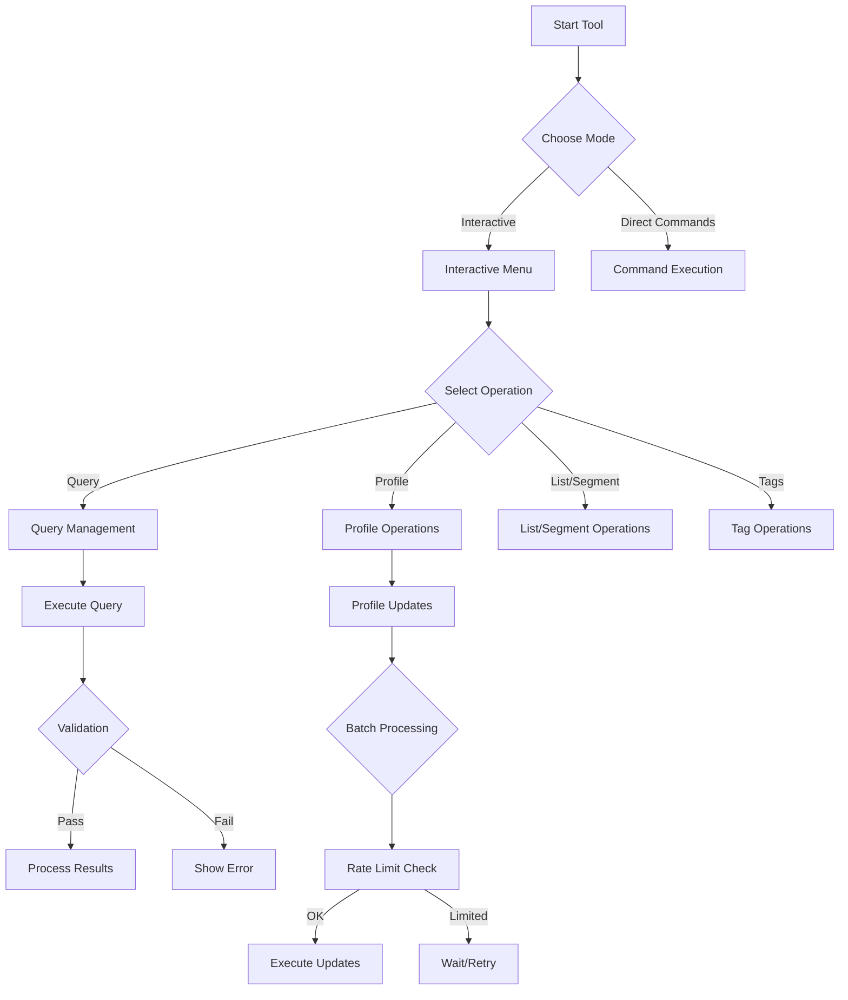
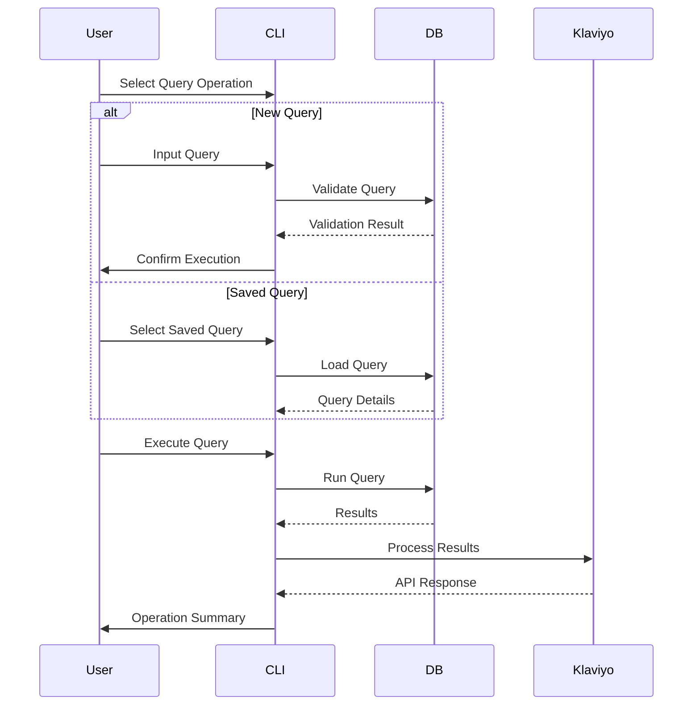
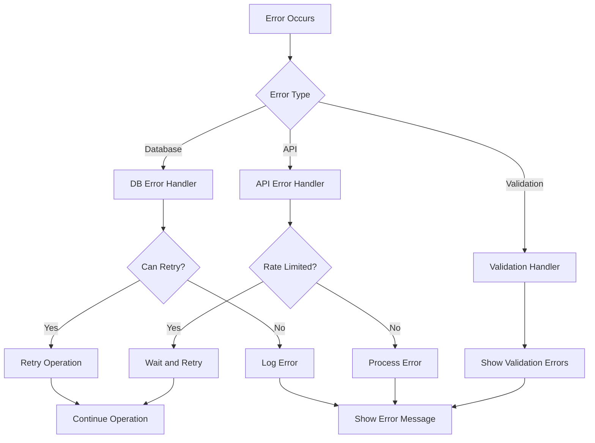
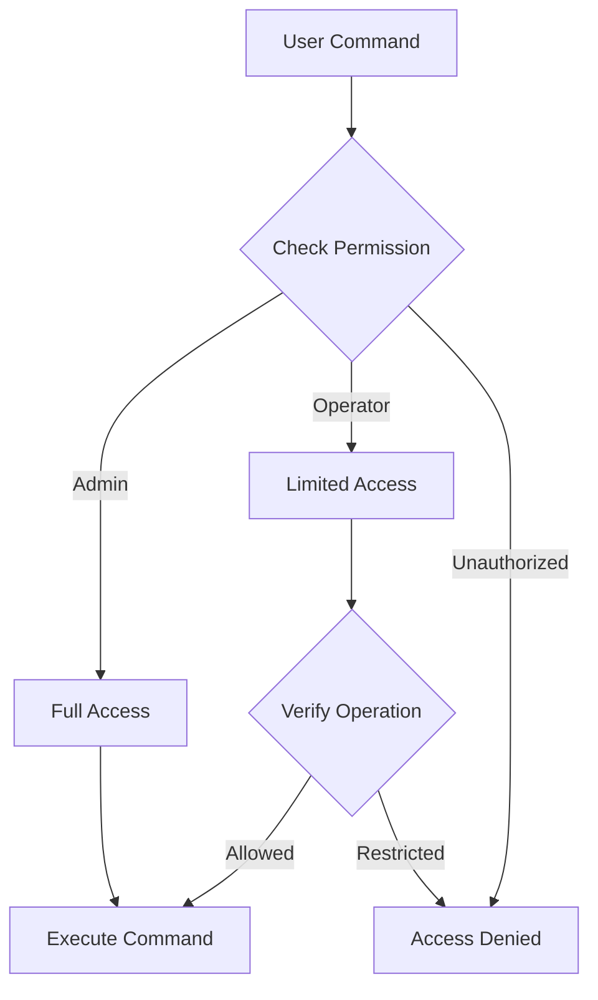

# User Flow Documentation

## CLI Command Flow



## Core User Journey

### Query Management Flow



### Error Handling



## Edge Cases

### Offline Mode

- Cache saved queries
- Queue failed operations
- Sync when connection restored

### Incomplete Data

- Validate before processing
- Skip invalid records
- Log validation failures

### Session Management

- Auto-retry on session expiry
- Maintain connection pools
- Handle timeout gracefully

## User Permissions

### Permission Levels

1. Admin

   - Full access to all operations
   - Can manage saved queries
   - Can modify batch settings

2. Operator
   - Can execute saved queries
   - Can perform profile updates
   - Cannot modify system settings

### Permission Flow



## CLI Interaction Examples

### Interactive Mode

```bash
$ tool interactive
> Select operation:
  1. Execute Query
  2. Manage Profiles
  3. Manage Lists/Segments
  4. Manage Tags
> Selected: 1
> Enter query name or 'new':
> new
> Enter query:
SELECT email FROM customers WHERE last_purchase > :date
> Enter parameters:
date (YYYY-MM-DD): 2024-01-01
> Executing query...
> Found 100 results
> Process results? [Y/n]
```

### Direct Command Mode

```bash
# Execute saved query
$ tool query run recent_customers --param date=2024-01-01

# Update profiles
$ tool profiles update --file profiles.csv --batch-size 50

# Create list
$ tool lists create "New Customers" --description "Customers from Jan 2024"
```
